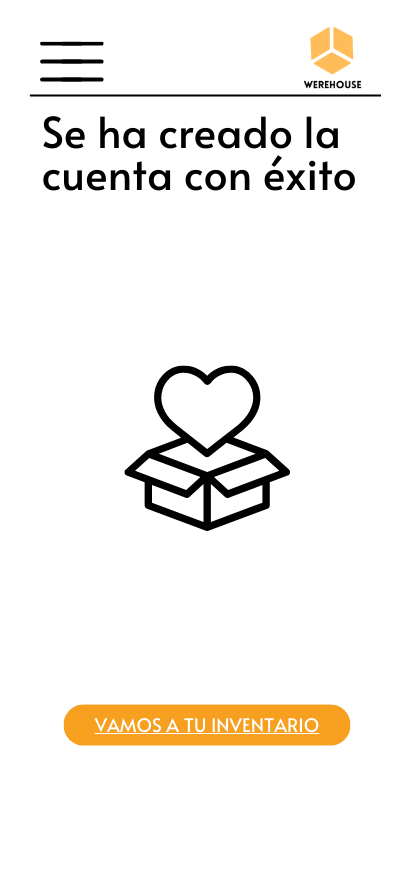

# Interfaz de Usuario ***Werehouse***

Este documento describe las pantallas clave del prototipo de la aplicación Werehouse, diseñado para facilitar la gestión de inventario en tiendas y sucursales. El diseño se centra en una experiencia de usuario intuitiva y eficiente, permitiendo a los usuarios navegar y realizar tareas de manera sencilla.

## 1. Pantalla de Bienvenida

* **Descripción**:
  * Presenta el encabezado con el icono de iniciar sesion y el menu de hamburguesa seguido de un breve mensaje de bienvenida, los diferentes Productos y un boton para agregar productos.
* **Elementos**:

  * Enabezado con funcionaldides y click en el menu de hamburguesa,incono que redirige a pantalla de inicio de sesion.
  * Scroll de Los diferentes productos con sus desplegables y filtros.
  * Botón "Agregar Producto" que redirige a la pantalla de inicio de sesión.
 
* **Mockup**:

    
 
## 2. Pantalla de Inicio de Sesión

* **Descripción**:
   * Permite al usuario ingresar a su cuenta con su correo electrónico y contraseña.

* **Elementos**:

  * Enabezado con funcionaldides y click en el menu de hamburguesa, Logo de werehouse.
  * Campo de texto para correo electrónico.
  * Campo de texto para contraseña.
  * Botón "Iniciar Sesión".
  * Enlace "¿Olvidaste tu contraseña?".
  * Enlace "Crear Cuenta" redirige hacia la pantalla de registro.

* **Mockup**:

    

## 3. Pantalla de Registro

* **Descripción**:
   * Proporciona un formulario para que nuevos usuarios creen una cuenta.

* **Elementos**:

  * Enabezado con funcionaldides y click en el menu de hamburguesa, Logo de werehouse.
  * Imagen
  * Campos para nombre, correo electrónico, contraseña y confirmación de contraseña.
  * Selector de tipo de usuario (cliente o staff).
  * Botón "Registrarse".
  * Enlace redirige hacia Se ah creado la cuenta con exito.

* **Mockup**:

    

## 4. Creacion de Cuenta Con Exito

* **Descripción**:
   * Muestra La creacion con exito de la cuenta

* **Elementos**:

  * Enabezado con funcionaldides y click en el menu de hamburguesa, Logo de werehouse.
  * Texto que indica la creacion con exito.
  * Imagen
  * Botón para volver hacia el inventario.

* **Mockup**:

    

## 5. Pantalla de Detalle de Producto

* **Descripción**:
   * Muestra los detalles del producto registrado.

* **Elementos**:

  * Nombre del Producto
  * Cantidad
  * Precio de compra Y precio de venta
  * Descripcion del producto
  * La sucursal a la cual pertenece
 
* **Mockup**:

    

## 6. Pantalla de Agregar Producto

* **Descripción**:
   * Permite al usuario registrar un nuevo producto en el sistema.

* **Elementos**:

  * Campos para insertar una imagen del producto
  * Campo de texto para ingresar nombre, cantidad, Precio de compra y venta, descripcion del producto y sucursal.
 
* **Mockup**:

    

## 7. Pantalla Añadir Sucursal

* **Descripción**:
   * Permite al usuario registrar una nueva sucursal en el sistema.

* **Elementos**:

  * Campo para el icono de la sucursal
  * Campo de texto para ingresar nombre de sucursal, Direccion, Persona a cargo (Staff)
 
* **Mockup**:

    

## 8. Pantalla Añadir Staff

* **Descripción**:
   * Permite al usuario registrar un nuevo responsable (Staff) en el sistema.

* **Elementos**:

  * Campo para icono del Responsable
  * Campo de texto para ingresar nombre del Responsable, Id, Tienda a cargo (Sucursal)
 
* **Mockup**:

    
